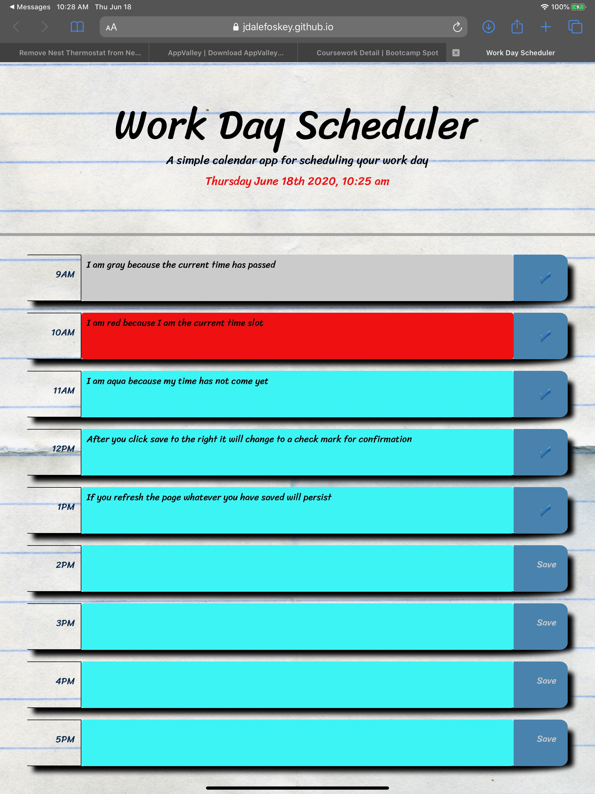

# Homework Assignment 5: Day Planner
---

## Description
This project is my 5th project deployed while taking the Web Developer Bootcamp at UNC.  It provides a fun approach at learning javascript by creating a day planner that allows you to put in new entries, save entries, it also highlights the timeslots by color based on current time you open it . All of this was created with HTML, CSS, Javascript, Jquery, Bootstrap only.

## Getting Started
---
These instructions will get you a copy of the project up and running on your local machine for development and testing purposes. See deploying the game for notes on how to deploy the project on a live system.

## Prerequisites
---
Windows or Mac file expolorer
Working web browers (ie Chrome browser, Mozilla Firefoxi)
Code editing software (ie Sublime text, Visual Studio Code)
Terminal window
internet access

## Installation
---
Using your filesystem explorer locate the html and css files
Then either open the html files in browser for inspection, or using your choice of code editor to edit.

## Deploying the Scheduler
---
From any web browser visit this site  https://jdalefoskey.github.io/homeworkfive/ to begin using

## Repository contents
---
All files for the GitHub pages site reside in the  directory and were used only to submit the homepage for the project.

 
